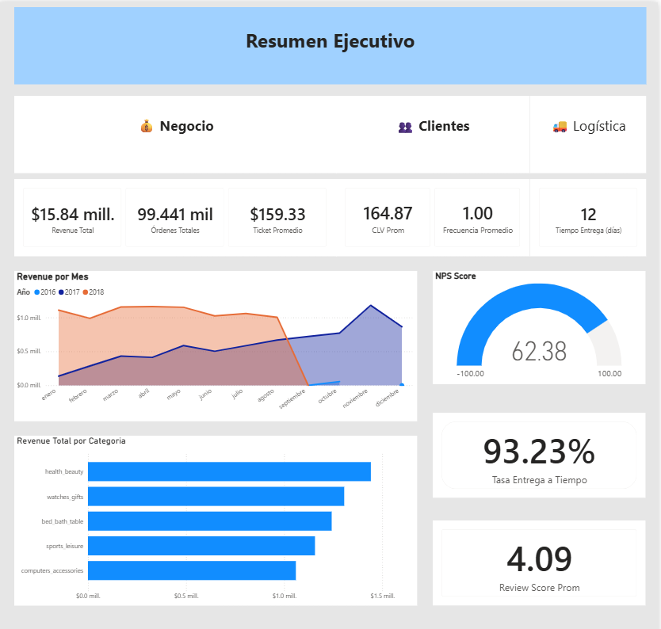
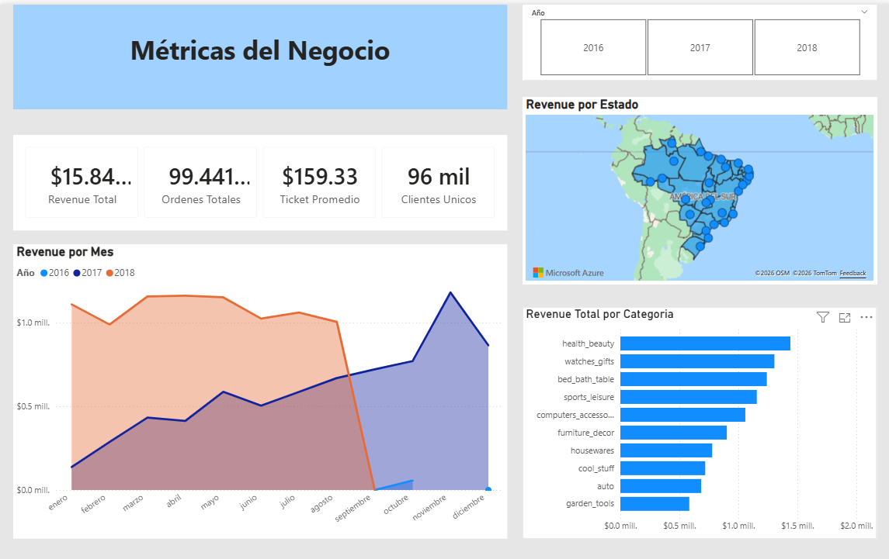

[README.md](https://github.com/user-attachments/files/26068753/README.md)
# 🛒 E-Commerce Analytics Dashboard — Olist Brazil

## 📌 Descripción
Dashboard ejecutivo desarrollado en Power BI sobre el dataset 
público de Olist, la mayor plataforma de e-commerce de Brasil.
Análisis de +99,000 órdenes entre 2016-2018.

## 🎯 Dashboards
- **Métricas de Negocio** — Revenue, KPIs, categorías, mapa
- **Análisis de Clientes** — CLV, frecuencia, tipo de pago
- **Logística y Satisfacción** — NPS, tiempos, satisfacción
- **Resumen Ejecutivo** — Vista consolidada para decisiones

## 📊 Tecnologías
- Power BI Desktop
- DAX (12+ medidas)
- Power Query (9 tablas, star schema)
- Dataset: Brazilian E-Commerce Public Dataset by Olist (Kaggle)

## 🔢 Datos clave
| Métrica | Valor |
|---------|-------|
| Revenue Total | R$ 15.84M |
| Órdenes Totales | 99,441 |
| Ticket Promedio | R$ 159.33 |
| NPS Score | 62.38 |
| Tasa Entrega a Tiempo | 93.23% |
| Review Score Promedio | 4.09 / 5 |

## 📸 Screenshots



## 👤 Autor
Héctor — Data Analytics & BI Portfolio
```

### 4️⃣ Sube todo a GitHub
```
git add .
git commit -m "Proyecto 3: Dashboard E-Commerce Olist completo"
git push origin main
