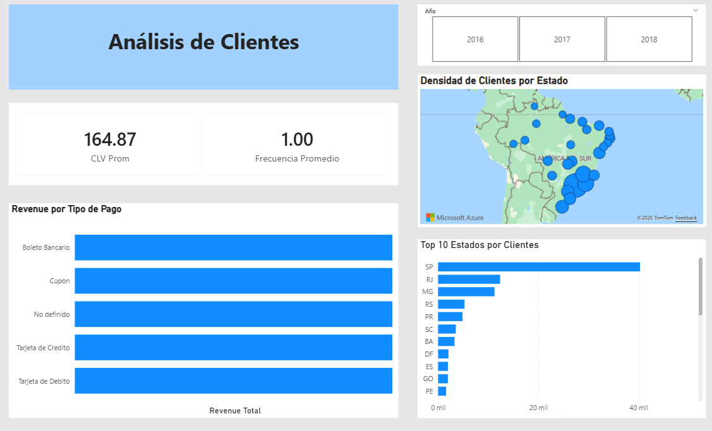
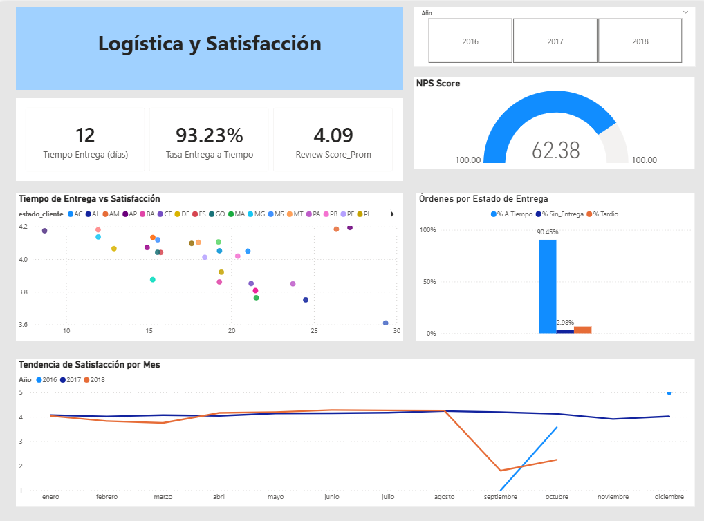

# 🛒 Dashboard E-Commerce — Brazilian Olist Analytics

## Descripción

Dashboard interactivo de 4 páginas construido en Power BI para analizar 
el rendimiento comercial, comportamiento de clientes y eficiencia logística 
de Olist, la mayor plataforma de e-commerce de Brasil. El objetivo es 
permitir a los equipos de Negocio, Marketing y Logística tomar decisiones 
basadas en datos sobre +99,000 órdenes realizadas entre 2016 y 2018.

## 🎯 Objetivo

Construir un sistema de 3 dashboards interconectados más un Resumen Ejecutivo 
en Power BI que cubra las tres áreas críticas del negocio: rendimiento comercial, 
comportamiento de clientes y eficiencia logística — todo con el fin de identificar 
oportunidades de crecimiento y mejora operativa.

## 📈 KPIs e Indicadores

| Indicador | Valor | Descripción |
|---|---|---|
| **Revenue Total** | R$ 15.84M | Ingresos totales incluyendo flete |
| **Órdenes Totales** | 99,441 | Total de órdenes registradas |
| **Ticket Promedio** | R$ 159.33 | Valor promedio por orden |
| **Clientes Únicos** | 96,096 | Clientes distintos en el período |
| **NPS Score** | 62.38 | Índice de satisfacción del cliente |
| **Tasa Entrega a Tiempo** | 93.23% | Órdenes entregadas en fecha estimada |
| **Review Score Promedio** | 4.09 / 5 | Calificación promedio de los clientes |
| **Tiempo Entrega Promedio** | 12 días | Días promedio desde compra hasta entrega |

## 🔍 Páginas del Dashboard

### Página 1 — Métricas de Negocio

Vista ejecutiva con los KPIs principales de revenue y órdenes, tendencia 
de revenue mensual por año, top 10 categorías de productos por revenue y 
mapa de Brasil con distribución de ventas por estado. Incluye slicer por año.


### Página 2 — Análisis de Clientes ⭐ (Página Estrella)

Analiza el comportamiento de los clientes usando CLV Promedio, Frecuencia 
de compra y distribución geográfica. Incluye revenue por tipo de pago, 
mapa de densidad de clientes por estado y Top 10 estados por clientes únicos. 
Filtro por año.



### Página 3 — Logística y Satisfacción

Analiza la eficiencia operativa y satisfacción del cliente. Incluye gauge 
de NPS Score, scatter de tiempo de entrega vs satisfacción por estado, 
distribución de órdenes por estado de entrega y tendencia de satisfacción 
mensual. Filtro por año.



### Página 4 — Resumen Ejecutivo

Vista consolidada con los KPIs más importantes de las 3 áreas del negocio. 
Diseñada para toma de decisiones ejecutivas y presentación de portafolio.


## 💡 Hallazgos Clave

### Negocio
- **Salud y Belleza** es la categoría líder en revenue, seguida de Relojes y Regalos.
- El revenue muestra **crecimiento sostenido en 2017**, con pico en noviembre (Black Friday).
- **São Paulo concentra** la mayor parte del revenue y clientes del país.

### Clientes
- La **mayoría de clientes compra una sola vez** — oportunidad clave para estrategias de retención.
- El **Boleto Bancario** es el método de pago predominante en Brasil.
- Los estados del sureste (SP, RJ, MG) concentran la mayor densidad de clientes.

### Logística
- **93.23% de entregas a tiempo** — alto nivel de cumplimiento operativo.
- El **NPS Score de 62.38** indica una base de clientes promotores sólida.
- Se observa correlación negativa entre tiempo de entrega y satisfacción — a más días, menor rating.

## 🛠️ Herramientas Utilizadas

- **Power BI Desktop** — Modelado de datos, visualización y diseño del dashboard
- **DAX** — 15+ medidas calculadas (Revenue, NPS, CLV, tasas de entrega, etc.)
- **Power Query** — ETL y transformación de 9 tablas, star schema, columnas calculadas

## 📐 Medidas DAX

### Revenue Total
```dax
Revenue Total = 
SUMX(
    fact_order_items,
    fact_order_items[price] + fact_order_items[freight_value]
)
```

### NPS Score
```dax
NPS_Score = 
VAR Promotores = CALCULATE(COUNTROWS(fact_reviews), fact_reviews[review_score] >= 4)
VAR Detractores = CALCULATE(COUNTROWS(fact_reviews), fact_reviews[review_score] <= 2)
VAR Total = COUNTROWS(fact_reviews)
RETURN
DIVIDE(Promotores - Detractores, Total, 0) * 100
```

### Tasa Entrega a Tiempo
```dax
Tasa Entrega a Tiempo = 
DIVIDE(
    CALCULATE(COUNTROWS(fact_orders), fact_orders[Entrega_a_Tiempo] = "A Tiempo"),
    CALCULATE(COUNTROWS(fact_orders), fact_orders[Entrega_a_Tiempo] <> "Sin Entrega"),
    0
)
```

### CLV Promedio
```dax
CLV_Prom = 
DIVIDE([Revenue Total], [Clientes Únicos], 0)
```

## 🗂️ Modelo de Datos

- **Tablas de hechos:** fact_orders, fact_order_items, fact_payments, fact_reviews
- **Tablas de dimensiones:** dim_clientes, dim_productos, dim_sellers, dim_fechas, dim_geolocalizacion
- **Esquema:** Star Schema con 9 tablas y 7 relaciones
- **Tabla de medidas:** _Medidas — contiene todas las medidas DAX del proyecto

## 📂 Estructura del Repositorio
```
📁 powerbi-ecommerce-olist/
├── 📄 README.md                          ← Este archivo
├── 📁 dashboard/
│   └── dashboard-ecommerce-olist.pbix    ← Archivo de Power BI
└── 📁 screenshots/
    ├── portada.png                        ← Portada de navegación
    ├── dashboard1-metricas.png            ← Métricas de Negocio
    ├── dashboard2-clientes.png            ← Análisis de Clientes
    ├── dashboard3-logistica.png           ← Logística y Satisfacción
    └── resumen-ejecutivo.png              ← Resumen Ejecutivo
```

## 📊 Fuente de Datos

- **Dataset:** Brazilian E-Commerce Public Dataset by Olist
- **Origen:** [Kaggle - Olist Dataset](https://www.kaggle.com/datasets/olistbr/brazilian-ecommerce)
- **Archivos:** 9 CSV interrelacionados
- **Registros:** +99,000 órdenes
- **Período:** 2016 — 2018

## 🚀 Cómo Usar Este Proyecto

1. Descarga el archivo `dashboard-ecommerce-olist.pbix` de la carpeta `dashboard/`.
2. Ábrelo con Power BI Desktop (versión gratuita).
3. Los datos ya están incluidos dentro del archivo .pbix.
4. Usa los slicers de año en cada página para explorar los datos por período.
5. Navega entre dashboards usando la portada o las pestañas inferiores.

## 👤 Autor

**Héctor** — Ingeniero en Logística (ESPOL) | En transición hacia Data Analytics & BI

Profesional con 4 años de experiencia en logística retail,
construyendo portafolio en análisis de datos y Business Intelligence.

Aprendiendo: Power BI | DAX | Python | Data Science

- LinkedIn: https://www.linkedin.com/in/h%C3%A9ctor-alvarado-47672419b/
- GitHub: https://github.com/hector216

---

⭐ Si este proyecto te resultó útil, no dudes en darle una estrella al repositorio.
